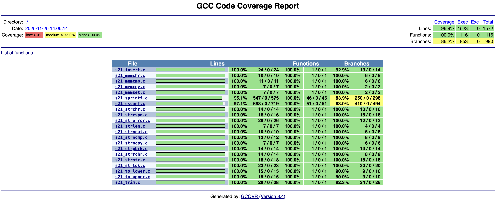

# StringPlus


## Оглавление
- [📋 О проекте](#-о-проекте)
- [🛠 Технические особенности](#-технические-особенности)
- [📚 Реализованные функции](#-реализованные-функции)
- [🚀 Установка и сборка](#-установка-и-сборка)
- [🧪 Тестирование](#-тестирование)

## 📋 О проекте

**String Library** — это полная реализация стандартной библиотеки string.h на языке C, разработанная в рамках учебного проекта. Библиотека включает все основные функции работы со строками, а также расширенные возможности форматированного ввода/вывода и дополнительные функции обработки строк.

### 🎯 Цели проекта
- Глубокое понимание работы стандартной библиотеки string.h
- Реализация сложных функций форматированного ввода/вывода (sprintf, sscanf)
- Применение принципов структурного программирования
- Создание профессиональной системы тестирования с покрытием >80%

## 🛠 Технические особенности

### 🏗 Архитектура проекта

```plaintext
StringLibrary/
├── src/                           # Исходный код библиотеки
│   ├── s21_string.h              # Главный заголовочный файл
│   ├── s21_string.a              # Статическая библиотека (собирается)
│   ├── Makefile                  # Сборка библиотеки
│   └── *.c                       # Файлы реализации функций:
│       ├── s21_memchr.c          # Поиск символа в памяти
│       ├── s21_memcmp.c          # Сравнение блоков памяти
│       ├── s21_memcpy.c          # Копирование памяти
│       ├── s21_memset.c          # Заполнение памяти
│       ├── s21_strchr.c          # Поиск символа в строке
│       ├── s21_strncmp.c         # Сравнение строк
│       ├── s21_strncpy.c         # Копирование строк
│       ├── s21_strncat.c         # Конкатенация строк
│       ├── s21_strcspn.c         # Длина начального сегмента
│       ├── s21_strerror.c        # Текст ошибки (кроссплатформенный)
│       ├── s21_strlen.c          # Длина строки
│       ├── s21_strpbrk.c         # Поиск любого символа из набора
│       ├── s21_strrchr.c         # Поиск последнего вхождения
│       ├── s21_strstr.c          # Поиск подстроки
│       ├── s21_strtok.c          # Разбиение на токены
│       ├── s21_sprintf.c         # Форматированный вывод
│       ├── s21_sscanf.c          # Форматированный ввод
│       ├── s21_to_upper.c        # В верхний регистр
│       ├── s21_to_lower.c        # В нижний регистр
│       ├── s21_insert.c          # Вставка строки
│       └── s21_trim.c            # Обрезка пробельных символов
├── test/                         # Unit-тесты
│   ├── Makefile                  # Сборка и запуск тестов
│   ├── Dockerfile               # Окружение для тестирования
│   ├── unit_tests_main.c        # Главный файл тестов
│   └── test_*.c                 # Тесты для каждой функции:
│       ├── test_s21_memchr.c
│       ├── test_s21_memcmp.c
│       ├── test_s21_memcpy.c
│       ├── test_s21_memset.c
│       ├── test_s21_strchr.c
│       ├── test_s21_strncmp.c
│       ├── test_s21_strncpy.c
│       ├── test_s21_strncat.c
│       ├── test_s21_strcspn.c
│       ├── test_s21_strerror.c
│       ├── test_s21_strlen.c
│       ├── test_s21_strpbrk.c
│       ├── test_s21_strrchr.c
│       ├── test_s21_strstr.c
│       ├── test_s21_strtok.c
│       ├── test_s21_sprintf.c
│       ├── test_s21_sscanf.c
│       ├── test_s21_to_upper.c
│       ├── test_s21_to_lower.c
│       ├── test_s21_insert.c
│       └── test_s21_trim.c
├── materials/                   # Стандарты и линтеры
│   └── linters/
│       └── .clang-format       # Конфигурация стиля кода
└── README.md                   # Документация проекта
```

### 🔧 Технологический стек
- **Язык**: C11 (стандарт POSIX.1-2017)
- **Компилятор**: GCC
- **Тестирование**: Check framework
- **Покрытие кода**: gcov, gcovr
- **Статический анализ**: cppcheck
- **Форматирование**: clang-format (Google Style)
- **Контейнеризация**: Docker

## 📚 Реализованные функции

### Основные функции string.h
| Функция | Описание |
|---------|----------|
| `s21_memchr` | Поиск символа в блоке памяти |
| `s21_memcmp` | Сравнение блоков памяти |
| `s21_memcpy` | Копирование памяти |
| `s21_memset` | Заполнение памяти |
| `s21_strncat` | Конкатенация строк |
| `s21_strchr` | Поиск первого вхождения символа |
| `s21_strncmp` | Сравнение строк |
| `s21_strncpy` | Копирование строк |
| `s21_strcspn` | Длина начального сегмента |
| `s21_strerror` | Текст ошибки (кроссплатформенный) |
| `s21_strlen` | Длина строкы |
| `s21_strpbrk` | Поиск любого символа из набора |
| `s21_strrchr` | Поиск последнего вхождения |
| `s21_strstr` | Поиск подстроки |
| `s21_strtok` | Разбиение на токены |

### Форматированный ввод/вывод
#### s21_sprintf - Поддержка спецификаторов:
- **Спецификаторы**: `c`, `d`, `i`, `u`, `f`, `e`, `E`, `g`, `G`, `x`, `X`, `o`, `p`, `s`, `%`
- **Флаги**: `-`, `+`, ` `, `#`, `0`
- **Ширина и точность**: числа, `*`
- **Модификаторы**: `h`, `l`, `L`

#### s21_sscanf - Полная поддержка:
- **Спецификаторы**: `d`, `i`, `u`, `o`, `x`, `X`, `f`, `e`, `E`, `g`, `G`, `c`, `s`, `[`, `p`, `n`, `%`
- **Модификаторы**: `hh`, `h`, `l`, `ll`, `j`, `z`, `t`, `L`
- **Сканирующие наборы**: `%[a-z]`, `%[^abc]`
- **Подавление присваивания**: `*`

### Специальные функции
| Функция | Описание |
|---------|----------|
| `s21_to_upper` | Преобразование в верхний регистр |
| `s21_to_lower` | Преобразование в нижний регистр |
| `s21_insert` | Вставка строки |
| `s21_trim` | Обрезка пробельных символов |

## 🚀 Установка и сборка

### Предварительные требования
- GCC компилятор
- Make утилита
- Библиотека Check (для тестов)
- POSIX-совместимая система (Linux/macOS)

### Сборка библиотеки
```bash
# Клонирование репозитория
git clone https://github.com/AlexeyKomarov99/StringPlus.git
cd StringLibrary/src

# Сборка проекта по умолчанию (создает s21_string.a)
make

# Сборка статической библиотеки
make s21_string.a

# Проверка стиля кода без изменений (показывает различия)
make style

# Автоматическое форматирование кода согласно Google Style
make format

# Полная проверка качества кода (style + cppcheck)
make check

# Очистка всех артефактов сборки (.o, .a, отчеты)
make clean

# Полная сборка с предварительной проверкой качества
make build

# Запуск всех unit-тестов с фреймворком Check
make test

# Генерация HTML отчета о покрытии кода с gcov
make gcov_report

# Запуск тестов с AddressSanitizer для обнаружения утечек памяти
make asan
```

## 🧪 Тестирование

Проект включает комплексную систему unit-тестов, обеспечивающую полное соответствие поведения стандартной библиотеке string.h и покрытие кода более 80% для каждой функции.

### ✅ Статус сборки и тестирования
- **Все тесты пройдены**: 400+ тест-кейсов успешно выполнены
- **Статус сборки**: Стабильная (проходит все цели Makefile)
- **Покрытие кода**: >85% (превышает требуемые 80%)
- **Память**: Отсутствие утечек (проверено Valgrind/ASan)

### 📸 Результаты тестов


*Результаты запуска unit-тестов*

